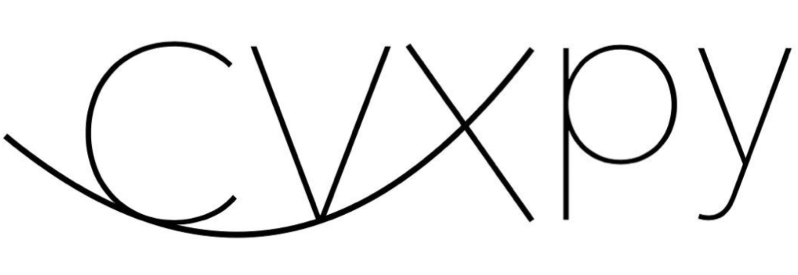
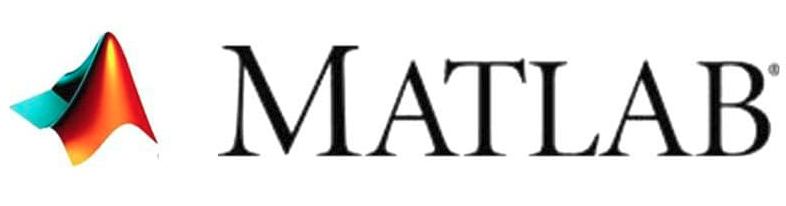
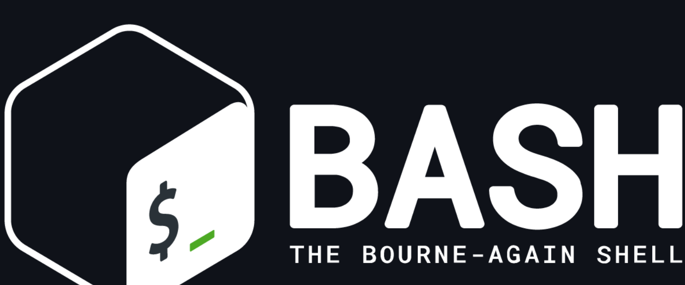
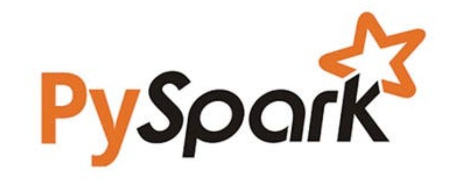
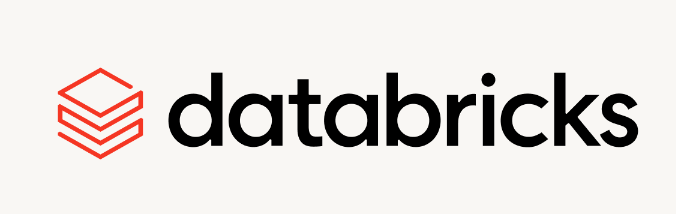

## Hi there, I'm Javier :rocket:

* :telescope:
I'm currently working on my MSc thesis. 
Check it out at the `EvCharge` and `VPP-Contracts` repos below :eyes:
About Machine Learning, Reinforcement Learning and Optimization for a roboust electrical grid.

* Side project is `SKaling`, a companion app for practicing scales and other musical exercises :notes:

* :gear: My favorite tech to use
    *  
    *  
    *  

 

<!-- **Programming** -->
<!--   -->
<!--   -->
<!--   -->
<!--   -->
<!--  -->
<!--  -->
<!--   -->
<!--  -->
<!---->
<!-- **Python Libraries** -->
<!---->
<!--   -->
<!--   -->
<!--   -->
<!--   -->
<!--   -->
<!--   -->
<!---->
<!-- **Databases** -->
<!---->
<!--   -->
<!--   -->
<!--  -->
<!---->
<!-- **Cloud** -->
<!---->
<!--   -->
<!--   -->
<!--   -->
<!---->
<!-- **Tools** -->
<!---->
<!--   -->
<!--   -->
<!--   -->
<!--   -->
<!--   -->

<!--
**J27avier/J27avier** is a ✨ _special_ ✨ repository because its `README.md` (this file) appears on your GitHub profile.

Here are some ideas to get you started:

- 🔭 I’m currently working on ...
- 🌱 I’m currently learning ...
- 👯 I’m looking to collaborate on ...
- 🤔 I’m looking for help with ...
- 💬 Ask me about ...
- 📫 How to reach me: ...
- 😄 Pronouns: ...
- ⚡ Fun fact: ...
-->
